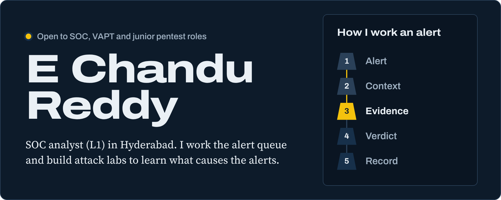
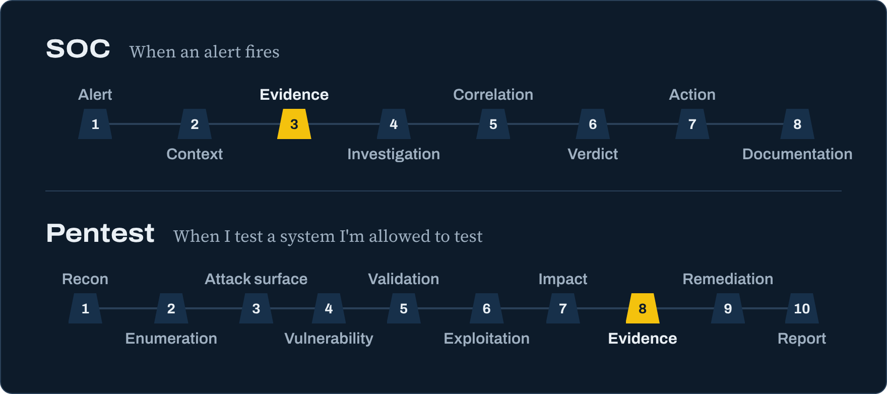

&ensp;&ensp;&ensp;

## Right now

- SOC analyst (L1) intern at GBB (Gowra Bits & Bytes): triaging EDR and SIEM alerts, investigating PowerShell and command-line activity, writing tickets and escalating.
- Building a Python recon framework that automates passive OSINT and active footprinting.
- Working toward eJPT, then PNPT, then OSCP. None earned yet.

## How I work

Read the steps as text

**SOC:** alert, context, evidence, investigation, correlation, verdict, action, documentation.

**Pentest:** recon, enumeration, attack surface, vulnerability, validation, exploitation, impact, evidence, remediation, report.

The yellow marker is the step I do not skip: evidence. The report is the product, and a finding is only finished when someone else can reproduce it and fix it.

## Selected work

- **Active Directory attack lab** <code>Local&nbsp;lab</code> 
  Windows Server domain controller, Windows client and Kali attacker with deliberate misconfigurations: roastable accounts, unconstrained delegation, GenericAll ACL abuse, a delegated GPO and an ADCS ESC1 template. Used to practise attack paths up to DCSync and to write a pentest report.
- **Web application pentest lab** <code>Local&nbsp;lab</code> 
  DVWA assessments with Burp Suite, SQLMap and OWASP ZAP covering SQL injection, XSS and broken authentication, with CVSS-rated findings and remediation.
- **Android pentest lab** <code>Local&nbsp;lab</code> 
  Built at GBB. Kali on Proxmox, ADB, MobSF, JADX and Burp Suite for static and dynamic APK analysis: insecure storage, exported components, hardcoded secrets, authentication and API flaws.
- **Recon framework** <code>In&nbsp;progress</code> 
  Python framework combining passive OSINT and active network modules.
- **[Network intrusion detection prototypes](https://github.com/chandureddy-sec/Network-Traffic-Filtering-Intrusion-Detection-System-NTF-IDS-)** <code>Public&nbsp;repo</code> 
  Three experiments: a Flask and Scapy dashboard with a Random Forest, a Streamlit prototype with rule-based scoring and Gemini explanations, and a PyTorch LSTM-DQN agent. The README lists the limitations.
- **[Portfolio site](https://chandureddy-sec.github.io)** <code>Live</code> 
  One static page, self-hosted fonts, no trackers.

## Toolbox

| Area | Tools |
|---|---|
| **Testing** | `Burp Suite` `SQLMap` `OWASP ZAP` `Nmap` `Nessus` `Metasploit` `BloodHound` `Hashcat` `John the Ripper` `MobSF` `JADX` `ADB` |
| **Detection and analysis** | `EDR and SIEM triage` `Log analysis` `Wireshark` `MITRE ATT&CK` |
| **Building** | `Python` `Bash` `Scapy` `Flask` `Streamlit` `scikit-learn` `Git` |
| **Environment** | `Kali Linux` `Windows Server` `Proxmox` `VirtualBox` `VMware` |
| **Method** | `PTES` `OWASP Testing Guide` `OWASP Top 10` `CVSS` |

## Background

- **B.Tech in Cybersecurity**, Sri Venkateswara College of Engineering, Tirupati (2022 to 2026, CGPA 8.04)
- **Ethical hacking and penetration testing diploma**, Craw Security, Hyderabad (six months, completed 2026)
- **Ethical hacking hackathon**, Supraja Technologies (2025): live VAPT on web applications and network services, report delivered during the event
- **Google Cybersecurity Certificate** (Coursera)

> I only test systems I own or have written permission to test.
